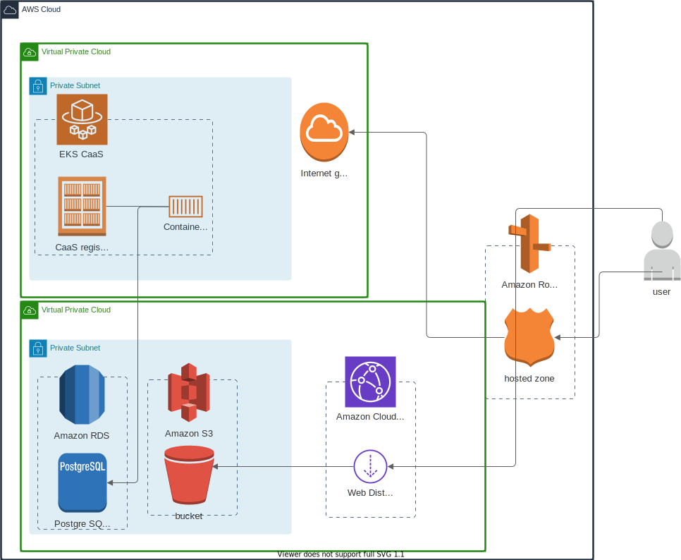

# dlt-reverse-transfer

DLT Reverse Transfer

## Troubleshooting steps

#### Get All Pods

```
kubectl get pods --all-namespaces
```

deploy the app in Jenkins and then refresh until you have a pod id you can look into

#### Look at logs on pod

```
kubectl logs dlt-reverse-transfer-server-deployment-6b47787f89-qt7hj -n=dlt-reverse-transfer
# Error from server (BadRequest): .... PodInitializing

```

### Deleting pods that are stuck

```
kubectl delete pod dlt-reverse-transfer-server-deployment-5745bc978f-c7c6g --now --namespace dlt-reverse-transfer
```

### CLI MAGIC

```
kubectl describe pod $(kubectl get pods --all-namespaces | grep dlt-reverse-transfer | awk -F ' ' '{print $2}') --namespace dlt-reverse-transfer
```

get most recent server logs

```
kubectl logs $(kubectl get pods --all-namespaces | grep dlt-reverse-transfer | awk -F ' ' '{print $2}') -n=dlt-reverse-transfer
```

### Avoiding DNS

```
curl -v --header 'Host: reverse-transfer-dlt-dev.caas-sandbox.asu.edu' https://lb-non-prod-nginx.caas-sandbox.asu.edu/
```

```
curl https://reverse-transfer-dlt-dev.caas-sandbox.asu.edu/
curl https://reverse-transfer-dlt-dev.caas-sandbox.asu.edu/example
```

updateing the security group

```
sg-0f2d151716b9d4f70 - default

## Architecture Diagram


```
